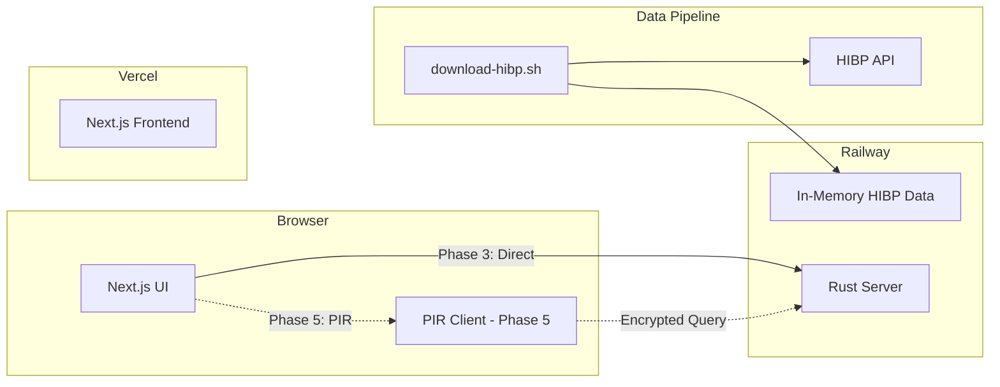

# PIR-Powered Password Breach Checker

## Overview

Build a privacy-preserving password breach checker using the HaveIBeenPwned Pwned Passwords database. Development is phased to establish a working baseline before integrating PIR.

## Architecture



## File Structure

```
pir/
├── src/                          # Core PIR library (existing)
├── password-demo/
│   ├── ui/                       # Next.js frontend
│   │   ├── app/
│   │   │   ├── page.tsx
│   │   │   └── api/check/route.ts
│   │   ├── package.json
│   │   └── next.config.js
│   ├── server/                   # Rust server
│   │   ├── Cargo.toml
│   │   ├── src/main.rs
│   │   └── Dockerfile
│   └── scripts/
│       └── download-hibp.sh
└── .github/workflows/
    └── sync-hibp.yml
```

---

## Phase 1: Data Download Script

**Goal:** Download the full HIBP Pwned Passwords database using curl.

**Deliverable:** `password-demo/scripts/download-hibp.sh`

```bash
#!/bin/bash
# Downloads all 1,048,576 HIBP range files (~38GB)
# Uses curl URL globbing with 150 parallel connections
# Takes ~15 minutes on a good connection

mkdir -p data/ranges && cd data/ranges
curl -s --retry 10 --retry-all-errors --remote-name-all \
  --parallel --parallel-max 150 \
  "https://api.pwnedpasswords.com/range/{0,1,2,3,4,5,6,7,8,9,A,B,C,D,E,F}{0,1,2,3,4,5,6,7,8,9,A,B,C,D,E,F}{0,1,2,3,4,5,6,7,8,9,A,B,C,D,E,F}{0,1,2,3,4,5,6,7,8,9,A,B,C,D,E,F}{0,1,2,3,4,5,6,7,8,9,A,B,C,D,E,F}"
```

Each range file contains suffix:count pairs. Full hash = prefix (filename) + suffix.

Source: [GitHub Issue #79](https://github.com/HaveIBeenPwned/PwnedPasswordsDownloader/issues/79)

---

## Phase 2: Server Baseline

**Goal:** Rust HTTP server that loads HIBP data into memory and answers password check queries directly.

**Deliverable:** `password-demo/server/`

**Endpoints:**

- `GET /health` - Health check
- `POST /check` - Check if SHA-1 hash is pwned, returns `{ pwned: bool, count: number }`

**Implementation:**

- Axum HTTP server
- On startup: load all range files into a `HashMap<[u8; 20], u32>` (hash -> count)
- Memory usage: ~900M entries × 24 bytes ≈ 22GB (or use more compact structure)
- For POC: can start with subset of data

---

## Phase 3: Client Baseline

**Goal:** Next.js frontend that checks passwords by querying the server directly (no PIR yet).

**Deliverable:** `password-demo/ui/`

**Features:**

- Password input field
- Client-side SHA-1 hashing (password never leaves browser in plaintext)
- Calls server `/check` endpoint with hash
- Displays result: "This password has been seen X times in data breaches"
- HIBP attribution footer

**Stack:** Next.js 14, App Router, Tailwind CSS

---

## Phase 4: Deployments

**Goal:** Deploy the baseline application.

**UI → Vercel:**

- Connect GitHub repo
- Auto-deploy on push
- Environment variable: `NEXT_PUBLIC_API_URL`

**Server → Railway:**

- Dockerfile-based deployment
- Mount persistent volume for HIBP data
- Or: download data on startup (slower cold starts)

**Daily Sync:** `.github/workflows/sync-hibp.yml`

- Cron: `0 2 * * *` (2am UTC daily)
- Downloads fresh HIBP data
- Triggers Railway redeploy or cache invalidation

---

## Phase 5: PIR Integration (Future)

**Goal:** Replace direct hash lookup with PIR queries for true privacy.

**Changes:**

- Add WASM bindings to PIR library (`src/wasm.rs`)
- UI loads PIR WASM module
- Client generates encrypted PIR query from hash
- Server answers PIR query using preprocessed database
- Client decrypts to get result

**Server changes:**

- `GET /setup` - Returns PIR parameters (matrix seed, hint)
- `POST /pir-query` - Accepts encrypted query, returns PIR answer
- Preprocess HIBP data into PIR matrix format on startup

**This phase is kept abstract** - implementation details depend on PIR library completion.

---

## Attribution

All pages include:

> Password data provided by [Have I Been Pwned](https://haveibeenpwned.com).

> This service uses Private Information Retrieval - the server never learns which password you're checking.